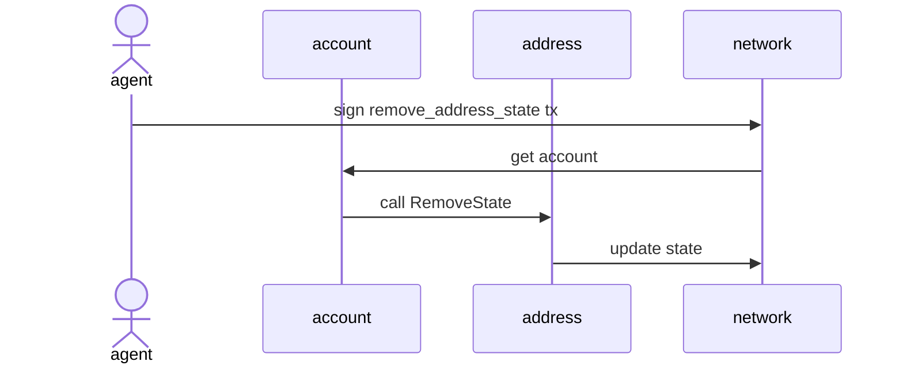

# Abstract

This proposal introduces a new action to remove states from addresses that are no longer used in the system (e.g., Shop, Ranking, ActivatedAccounts). This will enable efficient chain state management by cleaning up states from legacy system addresses.

# Motivation

Blockchain state data continuously grows, which can burden node operations. In particular, some system addresses set in the genesis block (such as Shop, Ranking, ActivatedAccounts) are no longer in use due to system updates. The states of these legacy system addresses create unnecessary overhead on the chain, necessitating a mechanism for their removal.

# Specification

A new action `RemoveAddressState` enables the removal of states from specific addresses.

## `RemoveAddressState`

The plain value is stored in Dictionary format like other actions. The schema is as follows:

```
{
  "type_id": "remove_address_state",                # action type name
  "values": {
    "r": [                                          # list of states to remove
      [AccountAddress, Address],                    # list of (account address, target address) pairs
      ...
    ]
  }
}
```



This action calls the `IAccount.RemoveState()` method to remove the state from the specified address.

## `SetAddressState`

This action is used to restore states removed by `RemoveAddressState` or set new states. The plain value is stored with the following schema:

```
{
  "type_id": "set_address_state",                   # action type name
  "values": {
    "s": [                                          # list of states to set
      [AccountAddress, Address, Value],             # list of (account address, target address, state value) pairs
      ...
    ]
  }
}
```


This action calls the `IAccount.SetState()` method to set the state at the specified address.

## Security Considerations

The two actions proposed in this NCIP have powerful permissions that can directly modify the chain's state. Each action carries the following security risks:

### RemoveAddressState Risks
- It is a dangerous operation that permanently deletes states from the chain.
- Once a state is removed, it cannot be recovered, which can significantly impact the chain's integrity.

### SetAddressState Risks
- Has the authority to overwrite existing states of an address with new states.
- Unintended loss of existing states may occur.
- Malicious state changes could interfere with normal system operation.
- There is a risk of breaking chain consistency.

Due to these risks, both actions have the following restrictions:

1. These actions can only be executed by specially designated administrator accounts.
2. The list of administrator accounts is strictly managed through chain policy settings.
3. All state modification operations are recorded on the chain for audit purposes.

Therefore, before executing these actions, the following considerations must be made:
- Thoroughly analyze the impact of state changes
- When using RemoveAddressState, establish a recovery plan using SetAddressState
- When using SetAddressState, analyze the impact of both existing and new states

# Backward Compatibility

This proposal requires hard-forks for the following reasons:
- New action types `remove_address_state` and `set_address_state` are added, and all nodes need to be updated to interpret these actions.
- While the `RemoveState` and `SetState` functionalities use existing `IAccount` interface methods, they require new logic for processing.
