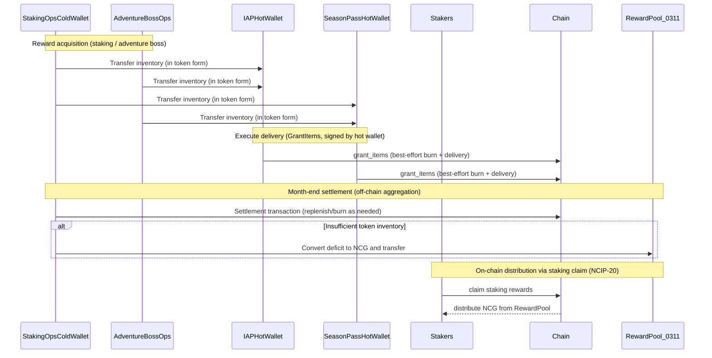

## Abstract

This proposal introduces **`GrantItems`, an operations-only action**, as an alternative to the existing `ClaimItems`-based distribution flow, to improve the reliability of item/asset delivery for IAP/SeasonPass purchasers (hereinafter “IAP/SeasonPass”).

This proposal **does not imply changing all users to use `GrantItems` instead of `ClaimItems`.** `GrantItems` is used **only by explicitly designated operations accounts (IAP, SeasonPass)**, and its signing authority is strictly controlled via an allow-list and administrative policies.

Even if the operations account (hot wallet) does not have sufficient token inventory (i.e., balance), `GrantItems` **prioritizes delivery to avoid transaction failures**. However, on-chain burning (`BurnAsset`) is performed **only to the extent possible** (if the balance is insufficient, only a portion is burned).

Based on this approach, usage is aggregated periodically and settled at month-end as part of the operational process. Responsibilities are separated as follows:

- **Delivery executor (hot wallet)**: The IAP and SeasonPass operations accounts sign `GrantItems` to execute delivery (burning is best-effort within the available balance).
- **Replenishment and settlement operator (cold wallet)**: The staking operations account (cold wallet) replenishes inventory for the target hot wallets and is responsible for month-end settlement based on aggregated usage (additional burning and/or covering shortfalls).

If token inventory is insufficient at settlement time, the deficit is converted to NCG value and transferred to **the staking distribution address (reward NCG aggregation address) defined in NCIP-20**.

- Staking distribution address (RewardPool): `0000000000000000000000000000000000000311` (source: `https://raw.githubusercontent.com/planetarium/lib9c/development/Lib9c/Addresses.cs`, lines 254–255)
  - RewardPool is used as an aggregation address that collects NCG used as fees in other actions into the reward pool.

## Motivation

In the current `ClaimItems`-centered distribution/delivery flow, if the operations account’s token inventory (balance) becomes insufficient, transaction failures or errors may occur, and these can **directly lead to delivery failures for users**. In particular, when item/asset transfers are designed around “claim” as proposed in `NCIP-16`, the following operational risks become more significant:

- **Delivery failure risk**: Inventory shortages directly cause distribution transactions to fail, preventing purchasers from receiving rewards immediately.
- **Increased operational response cost**: Failed distributions must be retried/reprocessed, and manual interventions by CS/ops teams become frequent.
- **Inventory management risk**: The distribution account balance must be kept sufficiently high at all times, increasing the frequency of funding/transfers/settlement and raising the chance of operational mistakes.
- **Uncertainty in schedule/event operations**: For IAP/SeasonPass with large distributions at fixed times or periods, temporary inventory shortages can escalate into broader service quality degradation.

This proposal separates “delivery (user experience)” from “settlement (inventory/accounting)”, ensuring reliable delivery for users while enabling consistent cost treatment and deficit settlement through a month-end settlement process.

## Rationale

### Clarifying Scope: Operations-only action, not a user action

`GrantItems` is not an action performed by regular users; it is an **operations-only action executed exclusively by the IAP/SeasonPass operations accounts (hot wallets)**. Therefore, the scope of this proposal is limited to the distribution mechanism for operations accounts, rather than changing the economy/behavior of all users.

### Separation of Hot Wallet (execution) and Cold Wallet (supply/coverage)

The operational model assumes the following:

- **Hot wallet (execution owner)**: The IAP and SeasonPass operations accounts sign `GrantItems` transactions to execute delivery.
- **Cold wallet (supply/coverage owner)**: The staking operations account (cold wallet) replenishes balances for the target (hot wallet) accounts.
- **How inventory is sourced**: IAP/SeasonPass inventory is secured by transferring rewards earned by the staking operations account (cold wallet) and the Adventure Boss operations account to the respective hot wallets “in token form.”

This structure prevents hot wallets from holding excessive inventory for long periods, while allowing delivery-failure risk to be absorbed through operational processes (replenishment/settlement).

## Specification

### `GrantItems` Overview

- **Action type**: `grant_items`
- **Target**: Distributes items and/or assets to multiple Avatar addresses, and records the distribution in in-game mail (Delivery).
- **Authorization**: Only signers included in a fixed allow-list, or valid administrators (Admin), can execute it.
- **Insufficient balance handling**: Distribution proceeds even if the operations account (signer) has insufficient balance; burning is performed only up to the amount possible within the available balance.

### Input Shape (Conceptual Schema)

As with other actions, the plain value is stored in a Dictionary-like form, and conceptually looks as follows:

```
{
  "type_id": "grant_items",
  "values": {
    "claim_data": [
      [AvatarAddress, [FungibleAssetValue, ...]],
      ...
    ],
    "memo": "optional memo"
  }
}
```

### Execution Steps (High Level)

1. **Aggregate requested amounts (by currency)**: Sum all requested distributions across recipients by Currency.
2. **Burn within feasible limits**: Check the signer’s balance and perform `BurnAsset` for each currency up to the smaller of (requested amount, available balance).
3. **Distribute and create delivery mail**:
   - For wrapped currencies, mint to the recipient address via `MintAsset`.
   - For item currencies, grant items to the recipient Avatar’s inventory (including quantity / tradability).
   - Record the distribution details in mail.
4. **Finalize mail and persist state**: Clean up the mailbox and update the Avatar state.

### Operational Flow (Including Month-End Settlement)

The following summarizes the operational accounts and the settlement flow.



Key points of month-end settlement:

- **Usage aggregation**: Aggregate monthly IAP/SeasonPass distribution amounts by currency.
- **Settlement (burn / coverage)**:
  - Account for the amount already burned on-chain during `GrantItems` execution (within available balances).
  - If necessary, the staking operations account (cold wallet) replenishes hot wallet inventory so that the operations account can perform additional burning (the detailed procedure is defined by operational policy).
  - If **token inventory itself is insufficient** and settlement cannot be completed via burning, convert the deficit to NCG value and transfer it to the staking distribution address (RewardPool).
  - NCG transferred to RewardPool is distributed on-chain to stakers via the **staking claim mechanism (NCIP-20)**.

> The NCG conversion basis (exchange rate / valuation method) is determined by operational policy and announcements, and may be left as TBD in this document.

## Security Considerations

Since misuse of `GrantItems` can effectively result in unlimited distributions, the following controls must be in place:

- **Authorization restriction**: Restrict executors via an allow-list and administrative policies (including expiration).
- **Hot wallet risk management**:
  - Since `GrantItems` is executed by a hot wallet, key compromise can lead to large-scale abuse.
  - Therefore, the hot wallet should maintain only “minimum necessary inventory,” and inventory supply should be handled by a cold wallet operational policy.
- **Cold wallet coverage/supply risk**:
  - Since the cold wallet (staking operations account) bears ultimate responsibility for replenishing the hot wallet, procedures are required to track and approve inventory flows (staking/adventure boss → hot wallet).
  - Because IAP/SeasonPass inventory depends on “staking/adventure boss rewards → hot wallet transfers,” fluctuations in reward generation, transfer delays, or operational mistakes can directly lead to hot wallet inventory shortages.
  - Therefore, inventory threshold monitoring, management of replenishment lead time (including cold wallet approvals), and audit of transfer logs from reward accounts (including the Adventure Boss operations account) to the hot wallet are required.
- **Auditability**:
  - It must be possible to reconcile month-end aggregated values with on-chain execution history based on distribution records (mail) and transaction logs.

## Backward Compatibility

Since this proposal introduces a new action type `grant_items`, all nodes in the network must be updated to interpret/validate the action. Therefore, a hard fork or an equivalent network upgrade procedure is required.

## Reference Implementation

- planetarium/lib9c PR [#3257 Feature/grant items](https://github.com/planetarium/lib9c/pull/3257)
